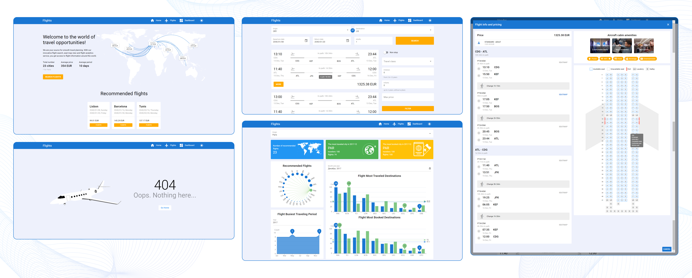

<a name="readme-top"></a>


<!-- PROJECT LOGO -->
<br />
<div align="center">
  <a href="https://github.com/OleinikovaPolina/Flights">
    
  </a>

  <h3 align="center">Flights</h3>

  <p align="center">
🛫🎫 We are your source for smooth travel planning. With our innovative flight search, seat map view and flight analytics service, you get access to flight information around the world.
    <br />
    <br />
    <a href="https://oleinikovapolina.github.io/Flights/dist/spa/">View Demo →</a>
  </p>
</div>


<!-- TABLE OF CONTENTS -->
<details>
  <summary>Table of Contents</summary>
  <ol>
    <li><a href="#about-the-project">About The Project</a></li>
    <li><a href="#built-with">Built With</a></li>
    <li><a href="#installation">Installation</a></li>
    <li><a href="#contact">Contact</a></li>
    <li><a href="#acknowledgments">Acknowledgments</a></li>
  </ol>
</details>


<!-- ABOUT THE PROJECT -->
## ✨ About The Project <a name="about-the-project"></a>



Website for searching flight tickets using <a href="https://developers.amadeus.com/">the amadeus API</a>

What's interesting:
* Ticket search page using filters
* View the aircraft seat map
* World map showing destinations from paris using geoclustering
* Dashboard
* Rotating 3D aircraft model for page 404
* Dark and light themes, loading svg for different themes

<p align="right">(<a href="#readme-top">back to top</a>)</p>


### 🏗️ Built With <a name="built-with"></a>

* 
* 
* 
* 
*  (Troisjs)
* geocluster
* vite-svg-loader

<p align="right">(<a href="#readme-top">back to top</a>)</p>


<!-- INSTALLATION -->
## ⚙️ Installation <a name="installation"></a>


```bash
yarn
# or
npm install
```

### Start the app in development mode (hot-code reloading, error reporting, etc.)
```bash
quasar dev
```


### Lint the files
```bash
yarn lint
# or
npm run lint
```


### Format the files
```bash
yarn format
# or
npm run format
```


### Build the app for production
```bash
quasar build
```

### Customize the configuration
See [Configuring quasar.config.js](https://v2.quasar.dev/quasar-cli-vite/quasar-config-js).

<p align="right">(<a href="#readme-top">back to top</a>)</p>


<!-- CONTACT -->
## 📧 Contact <a name="contact"></a>

Oleynikova Polina - oleinikowa.poly@gmail.com

Project Link: [https://github.com/OleinikovaPolina/Flights](https://github.com/OleinikovaPolina/Flights)

<p align="right">(<a href="#readme-top">back to top</a>)</p>


<!-- ACKNOWLEDGMENTS -->
## 📚 Acknowledgments <a name="acknowledgments"></a>

* [Amadeus for Developers - How to build an aircraft seat map in React](https://developers.amadeus.com/blog/react-seat-map)
* [Free aircraft 3d model (gltf)](https://www.cgtrader.com/free-3d-models/aircraft?free=1&file_types[]=117)
* [Free svg illustrations - undraw](https://undraw.co/illustrations)
* [Public apis](https://github.com/public-apis/public-apis)
* [Best README Template](https://github.com/othneildrew/Best-README-Template)

<p align="right">(<a href="#readme-top">back to top</a>)</p>
